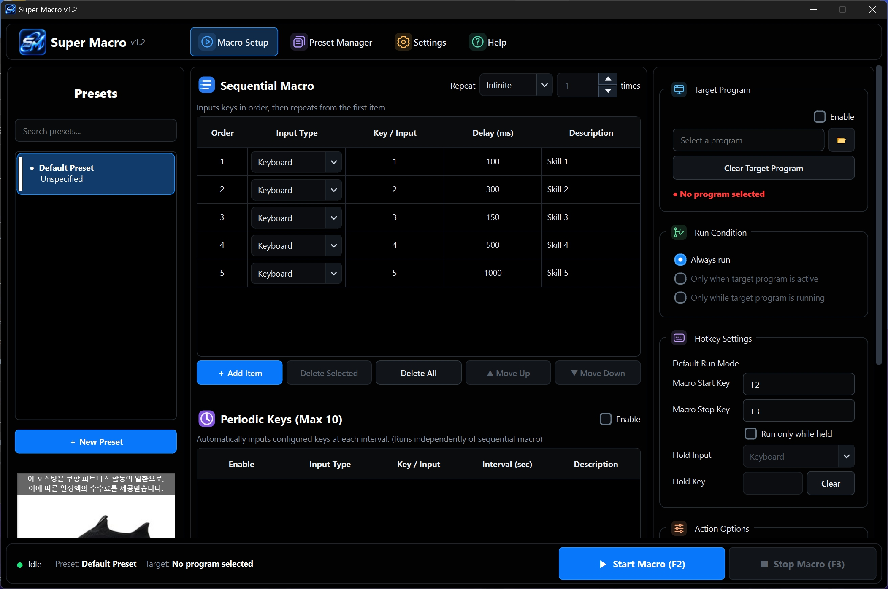

<div align="center">


# SuperMacro

**Your shortcuts. Your timing. Your workflow.**  
**원하는 키를, 원하는 순서와 간격으로.**

A customizable keyboard & mouse macro utility for Windows.  
Windows용 키보드·마우스 자동화 프로그램

[](https://github.com/Tera21a/SuperMacro-Update/releases)
[](https://github.com/Tera21a/SuperMacro-Update/releases)
[](#languages)
[](#security-en)

**[📦 Releases / 다운로드](https://github.com/Tera21a/SuperMacro-Update/releases)** · **[🐛 Report an issue / 오류 제보](https://github.com/Tera21a/SuperMacro-Update/issues)**

[**한국어**](#korean)　·　[**English**](#english)

</div>

---

<div align="center">
  
  <sub>실제 프로그램 화면 예시 · Interface preview from an earlier build; the current version may differ.</sub>
</div>

---

<a id="korean"></a>

## 🇰🇷 한국어

### SuperMacro 소개

**SuperMacro**는 반복적인 키보드·마우스 입력을 간편하게 설정할 수 있는 Windows 데스크톱 프로그램입니다. 원하는 순서대로 키를 입력하거나, 특정 키를 주기적으로 반복하고, 목적에 따라 서로 다른 설정을 **프리셋**으로 관리할 수 있습니다.

복잡한 스크립트를 작성하지 않고 프로그램 화면에서 입력 순서와 시간을 설정하는 방식입니다.

### ✨ 주요 기능

| 기능 | 설명 |
| :--- | :--- |
| ⌨️ **순차 매크로** | 키보드·마우스 입력을 순서대로 실행하고 각 단계의 지연 시간(ms)을 개별 설정 |
| 🔁 **반복 설정** | 무한 반복 또는 지정한 횟수만큼 반복 실행 |
| ⏱️ **주기 키** | 순차 매크로와 별도로 설정한 키를 일정 주기마다 입력 (프리셋당 최대 10개) |
| ✋ **누르고 있는 동안 실행** | 설정한 키 또는 마우스 버튼을 누르고 있는 동안만 매크로 실행 |
| 💬 **채팅 매크로** | 미리 작성한 문구를 단축키로 입력하거나 설정한 주기에 따라 자동 입력 |
| 📋 **프리셋 관리** | 설정별 저장, 검색, 복제 및 전환 |
| 🎯 **대상 프로그램 지정** | 항상 실행 / 대상 프로그램이 활성 상태일 때 / 대상 프로그램이 실행 중일 때 중 선택 |
| 🎒 **아이템 빨리 줍기** | 사용 키를 누르고 있는 동안 지정한 입력 키를 반복하는 별도 기능 |
| 🖥️ **Windows 연동** | 시작 시 자동실행, 시스템 트레이, 다크·라이트 테마 |
| 🔐 **업데이트 검증** | 배포 정보의 Ed25519 전자서명 및 파일 SHA-256 해시 검사 |

> **채팅 매크로 안내:** 수동·자동 모드, 텍스트 직접 입력 또는 클립보드 붙여넣기 방식을 선택할 수 있습니다. 일부 게임이나 프로그램은 자동 입력을 허용하지 않거나 정상적으로 처리하지 않을 수 있습니다.

### 🚀 시작하기

1. **[GitHub Releases](https://github.com/Tera21a/SuperMacro-Update/releases)**에서 현재 배포 안내와 다운로드 파일을 확인합니다.
2. 일반 사용자용 배포 파일을 다운로드하고 원하는 폴더에 압축을 해제합니다.
3. `Super Macro.exe` 또는 배포 파일에 안내된 실행 파일을 실행합니다.
4. 프리셋을 생성하거나 선택한 뒤 **순차 매크로**에 키와 지연 시간을 설정합니다.
5. 필요하면 **주기 키**, **실행 조건**, **채팅 매크로**를 추가로 설정합니다.
6. 매크로를 시작하고 종료합니다. 새 프리셋의 기본 단축키는 **F2(시작)** / **F3(종료)**이며 변경할 수 있습니다.

> **다운로드 구분:** Release에 있는 `SuperMacro_Update.zip`은 프로그램 내 온라인 업데이트용으로 생성되는 파일입니다. 최초 설치 시에는 해당 Release의 설명에서 사용자용 배포 파일 구성과 설치 안내를 확인하세요.

### 🌐 지원 언어

<a id="languages"></a>

한국어 · English · Русский · 日本語 · 简体中文 · Tiếng Việt

언어와 다크·라이트 테마는 프로그램 설정에서 변경할 수 있습니다.

### 🔒 업데이트 및 보안

- 업데이트 정보에는 **Ed25519 전자서명**이 사용되며, 내려받은 파일은 **SHA-256** 해시로 검증됩니다.
- 서명이 유효하지 않거나 업데이트 정보가 올바르지 않은 경우 해당 업데이트는 설치하지 않습니다.
- 프로그램 안에서 업데이트 확인 기능을 제공하며 자동 확인 여부를 설정할 수 있습니다.
- **주의:** 전자서명된 업데이트는 Windows 코드 서명(Authenticode)이나 백신 무해성 보증을 뜻하지 않습니다.

### 🛡️ 개인정보 및 온라인 통계

SuperMacro v1.2는 실행 중인 프로그램의 대략적인 수와 국가별 분포를 집계하기 위해 약 **60초 간격**으로 서버에 신호를 전송할 수 있습니다.

- 전송 항목: 실행 세션마다 새로 생성되는 임시 무작위 ID, 프로그램 버전
- 접속 국가: Cloudflare가 네트워크 요청을 바탕으로 추정
- 입력한 키, 매크로 문구, 프리셋, 이름, 이메일, 기기 고유번호는 온라인 통계 DB에 저장하지 않음
- IP 주소는 통신 과정에서 Cloudflare에 전달될 수 있으며 Cloudflare의 자체 로그 정책이 적용될 수 있음
- 마지막 접속 신호 후 약 **180초**가 지나면 온라인 인원 집계에서 제외

**온라인 통계 전송을 끄는 방법:** 프로그램 `data` 폴더에 `online_presence.json` 파일을 만들고 다음 내용을 저장한 뒤 프로그램을 다시 시작합니다.

```json
{"enabled": false}
```

또는 Windows 환경 변수 `SUPER_MACRO_ONLINE_STATS=0`으로 실행할 수 있습니다.

프로그램 내 광고 영역에 외부 콘텐츠가 표시될 수 있으며, 해당 외부 서비스의 정책이 적용될 수 있습니다.

### ❓ 자주 묻는 질문

<details>
<summary><b>기존 프리셋을 업데이트 후에도 사용할 수 있나요?</b></summary>

일반적인 인앱 업데이트는 기존 `data` 폴더를 보존하도록 설계되어 있습니다. 중요한 프리셋은 업데이트 전 백업해 두는 것을 권장합니다.

</details>

<details>
<summary><b>게임이나 모든 프로그램에서 동작하나요?</b></summary>

아니요. 일부 게임·앱은 입력 자동화, 가상 키 입력 또는 클립보드 붙여넣기를 제한할 수 있습니다. 대상 프로그램의 이용약관과 정책을 확인하세요.

</details>

<details>
<summary><b>오류나 개선 의견은 어디로 보내면 되나요?</b></summary>

[GitHub Issues](https://github.com/Tera21a/SuperMacro-Update/issues)에 Windows 버전, SuperMacro 버전, 재현 방법을 적어 주세요. 암호·서명키·개인정보는 첨부하지 마세요.

</details>

---

<a id="english"></a>

## 🇬🇧 English

### About SuperMacro

**SuperMacro** is a configurable Windows desktop application for repetitive keyboard and mouse input. Build sequences with per-step delays, run keys at scheduled intervals, and organize different workflows into reusable **presets**—without writing scripts.

### ✨ Features

| Feature | Description |
| :--- | :--- |
| ⌨️ **Sequential macros** | Combine keyboard and mouse inputs in order, with independent per-step delays in milliseconds |
| 🔁 **Repeat controls** | Run continuously or for a specified number of cycles |
| ⏱️ **Periodic keys** | Trigger separate inputs at configurable intervals, up to 10 per preset |
| ✋ **Hold-to-run** | Run a macro only while a configured key or mouse button is held |
| 💬 **Chat macros** | Insert predefined text manually with a hotkey or automatically on a schedule |
| 📋 **Preset management** | Save, search, duplicate, and switch between configurations |
| 🎯 **Target application rules** | Always run, run only when the target app is focused, or when the target process is running |
| 🎒 **Rapid item pickup** | Repeatedly send a configured input while its activation key is held |
| 🖥️ **Windows integration** | Start with Windows, system tray support, and dark/light themes |
| 🔐 **Verified updates** | Ed25519-signed update metadata with SHA-256 package integrity checks |

> **Chat macro compatibility:** Direct Unicode input and clipboard paste are available. Some applications and games may block automated input or handle it differently.

### 🚀 Getting started

1. Visit **[GitHub Releases](https://github.com/Tera21a/SuperMacro-Update/releases)** and read the distribution notes.
2. Download the end-user distribution, then extract it into a folder of your choice.
3. Run `Super Macro.exe` (or the executable named in the release notes).
4. Create or select a preset, then add keys and delays in the **Sequential Macro** section.
5. Optionally configure **Periodic Keys**, **Target Application**, and **Chat Macro** settings.
6. Start or stop the macro using your configured hotkeys. The defaults for new presets are **F2 (start)** and **F3 (stop)**.

> **About release assets:** `SuperMacro_Update.zip` is generated for the application's online updater. For a first-time installation, refer to the release notes for the intended end-user package and setup steps.

### 🌐 Available languages

Korean · English · Russian · Japanese · Simplified Chinese · Vietnamese

You can change the language and dark/light appearance in Settings.

<a id="security-en"></a>

### 🔒 Updates & security

- Update metadata is authenticated with an **Ed25519 digital signature**; downloaded packages are checked against a **SHA-256** hash.
- Invalid or tampered update metadata is rejected before installation.
- Update checks are available in-app, with a configurable automatic-check setting.
- **Note:** Signed update metadata is not the same as Windows Authenticode signing and does not guarantee antivirus or SmartScreen approval.

### 🛡️ Privacy & online presence

Starting with v1.2, SuperMacro can send a heartbeat approximately **every 60 seconds** while running to estimate active application sessions and their country distribution.

- Transmitted: a random temporary session ID generated on each launch and the app version
- Country: estimated by Cloudflare from the incoming network request
- Key presses, macro messages, presets, names, emails, and persistent device identifiers are **not stored in the presence statistics database**
- Your IP address may be processed by Cloudflare to handle requests and may be subject to its logging policies
- Sessions are excluded from the online count approximately **180 seconds** after the last successful heartbeat

**Opt out of online presence statistics:** Create `data/online_presence.json` next to the application with the following content, then restart:

```json
{"enabled": false}
```

You can also launch the app with the Windows environment variable `SUPER_MACRO_ONLINE_STATS=0`.

Embedded ad areas may load third-party content, which may be subject to those services' privacy policies.

### ❓ FAQ

<details>
<summary><b>Will updating delete my presets?</b></summary>

The in-app updater is designed to preserve the existing `data` directory. Backing up important presets before updating is still recommended.

</details>

<details>
<summary><b>Does it work with every game and application?</b></summary>

No. Some games and applications restrict synthetic input, automated actions, or clipboard paste. Please follow the target application's terms of service and rules.

</details>

<details>
<summary><b>Where can I report a bug or suggest a feature?</b></summary>

Open an issue in [GitHub Issues](https://github.com/Tera21a/SuperMacro-Update/issues) with your Windows version, app version, and reproduction steps. Do not share passwords, signing keys, or personal data.

</details>

---

<div align="center">

**SuperMacro · Built for configurable Windows automation**

[Releases](https://github.com/Tera21a/SuperMacro-Update/releases) · [Issues](https://github.com/Tera21a/SuperMacro-Update/issues) · [Back to top](#supermacro)

<sub>This project is not affiliated with Microsoft or any game publisher.</sub>

</div>
